# flex布局

## flex-container(容器)的属性

### 1.flex-direction

    flex-direction这个属性定义了flex容器的主轴方向,默认值是row,主轴是水平方向,起点是左边。
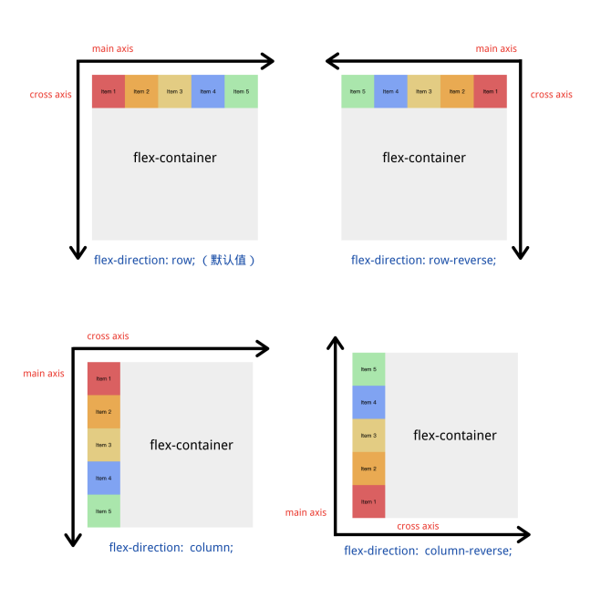
flex-direction的常用值:
```css
  flex-direction:row;/*默认值, 主轴方向为水平方向,起点在左边,项目从左往右排列*/
  flex-direction:row-reverse;/*主轴方向为水平方向,起点在右边,项目从右往左排列*/
  flex-direction:colunm;/*主轴方向为垂直方向,起点是上边，项目从上往下排列*/
  flex-direction:colunm-reverse;/*主轴方向为垂直方向,起点*/
```

### 2.flex-wrap

    flex-wrap这个属性控制的是容器内项目是否折行,默认值是nowrap,不折行
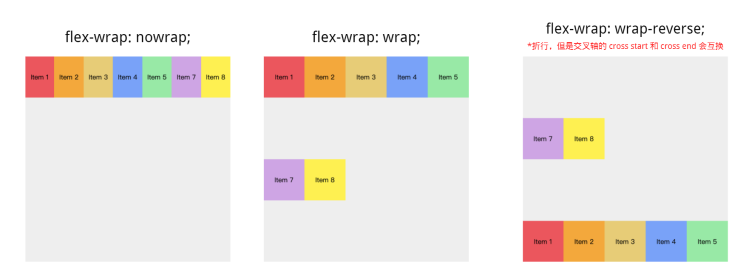
flex-wrap常用值:
```css
  flex-wrap:nowrap;/*默认值,不折行,项目内容超出容器之后不会折行,而是等比缩小*/
  flex-wrap:wrap;/*折行,超出容器后会折行*/
  flex-wrap:wrap-reverse;/*折行，但是交叉轴的cross start和cross end会互换*/
```
### 3.flex-flow

    flex-flow属性是flex-direction 和 flex-wrap 的简写。默认值是，row nowrap

### 4.justify-content

    justify-content这个属性控制的是项目主轴(max axis)上的排列方式。默认值是flex-start

justify-content常用值:
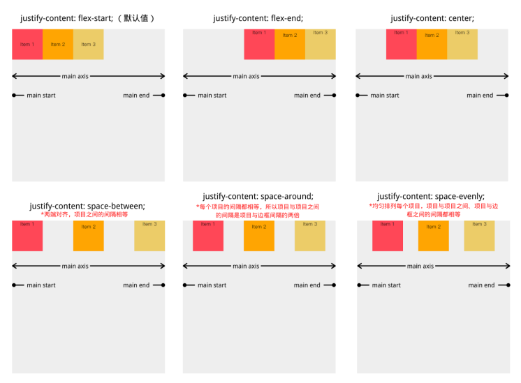
```css
  justify-content:flex-start;/*默认值，根据主轴起点对齐*/
  justify-content:flex-end;/*项目根据主轴终点对齐*/
  justify-content:center;/*项目根据主轴中心点对齐*/
  justify-content:space-between;/*两端对齐,项目之间的间隔相等*/
  justify-content:space-evenly;/*均匀排列每个项目,项目与项目之间/项目与边框之间的间隔都相等*/
```

### 5.align-items

    align-items是控制项目在交叉轴方向上的排列方式。默认值是stretch

align-items常用值:
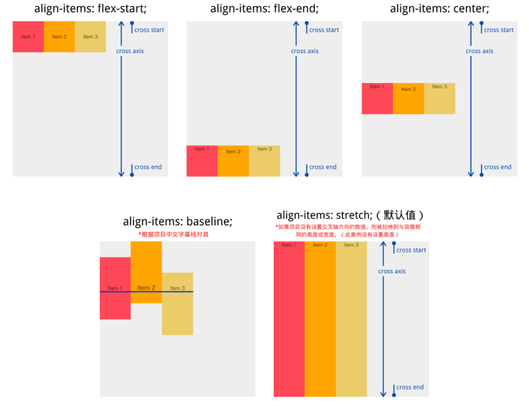
```css
  align-items:flex-start;/*根据交叉轴的起点对齐*/
  align-items:flex-end;/*根据交叉轴的终点对齐*/
  align-items:center; /*根据交叉轴的中心点对齐*/
  align-item:baseline;/*根据项目中文字基线对齐*/
  align-item:stretch;/*默认值,如果项目没有设定交叉轴方向的数值,则没拉伸到与容器相同的高度和宽度*/
```
### 6.align-content

    align-content属性定义了多根轴线在交叉轴(cross axis)的对齐方式,如果只有一根轴线(flex-wrap的值是nowrap),则不起作用。默认值是stretch
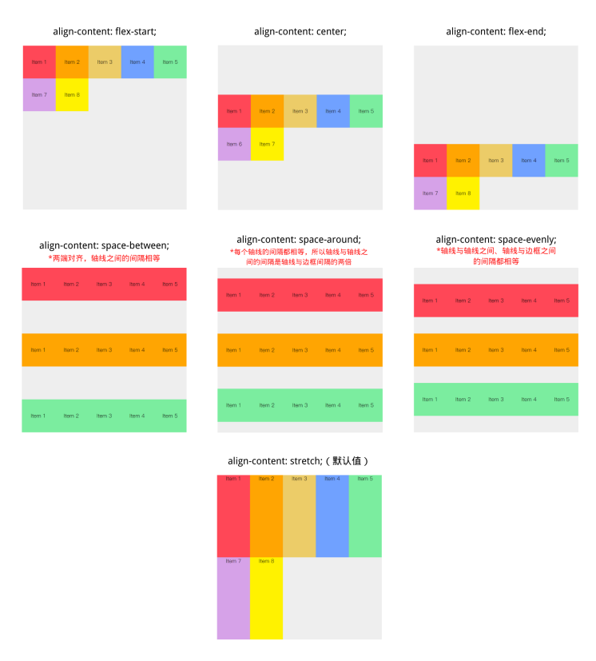
```css
  align-content:flex-start;/*根据交叉轴的起点对齐*/
  align-content:flex-end;/*根据交叉轴的重点对齐*/
  aligin-content:center;/*根据交叉轴的中心点对齐*/
  align-content:space-between;/*两端对齐,轴线之间的间隔相等*/
  align-content:space-around;/*每个轴线2的间隔都相等，所以轴线与轴线之间的间隔是轴线与边框之间的间隔的两倍*/
  align-content:space-evenly;/*轴线与轴线之间，轴线与边框之间的间隔都是相等*/
  align-conent:stretch;/*默认值,轴线占满整个交叉轴*/
```

## flex-item(项目)的属性

### 1.order

order属性控制的是项目在容器中的顺序,从小到大排列,默认值为0。
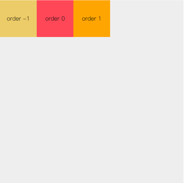
```css
  order:<integer> /*默认值是 0*/
```
### 2.flex-grow

flex-grow这个属性控制的是项目的增长比例,默认是0,表示即使容器内有剩余空间，项目也不会放大。

Tip:如果项目在主轴方向上的情况下设置了max-height/max-width,那么该项目放大的最大宽度/高度不超过 max-width/max-height
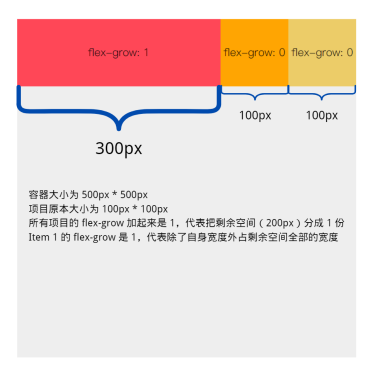
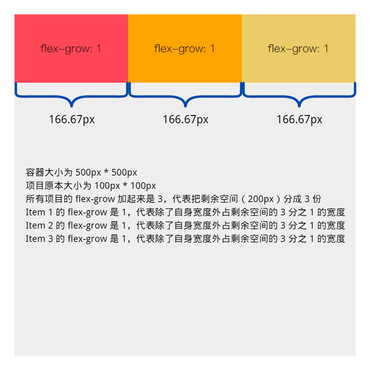
```css
  flex-grow:<number>/*默认值是 0*/
```
如果所有的项目的flex-grow 的值都相同,那么所有的项目获得相同的剩余空间,否则将根据不同的flex-grow值定义的比例进行分配

### 3.flex-shrink
flex-shrink这个属性控制的是项目的收缩比例,默认值是1,如果空间不足该项目将收缩.

Tip：如果项目在主轴方向上的情况下设置了 min-width/min-height ，那么该项目缩小的最小宽度/高度不超过 min-width/min-height。
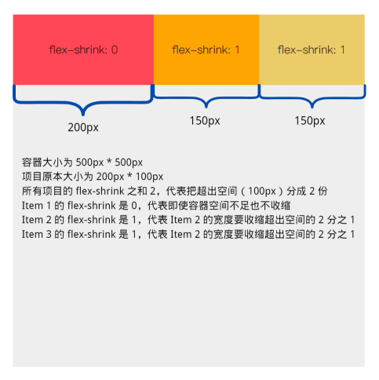
```css
  flex-shrink:<number>/*默认值是1*/
```
1.如果一个项目的flex-shrink的值是0, 代表即使容器空间不足该项目也不收缩。
2.项目仅在默认宽度之和大于容器的时候才会发生收缩,其收缩的大小是依据flex-shrink的值。


### 4.flex-basis
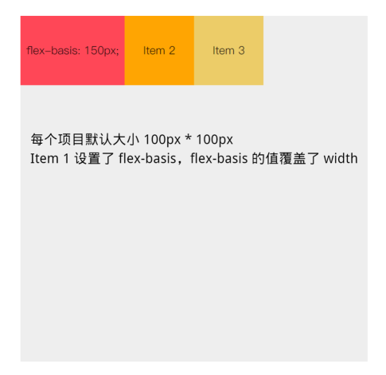
flex-basis指定了项目在主轴方向上的初始大小。默认值是auto,即原本大小。
如果在flex-direction 是row的情况下,同时设置了width和flex-basis,flex-basis会覆盖width,flex-basis有更高的优先级


### 5.flex
flex属性是 flex-grow  flex-shrink flex-basis的简写属性.默认值是 0 1 auto

```css
/* flex:<flex-grow> <flex-shrink> <flex-basis> */
/*一个值，无单位数字:flex-grow*/
flex:2;
/*一个值,width/height:flex-bassis*/
flex:10%;
flex:30px;
/*两个值:flex-grow|flex-shrink*/
flex:2 2;
```

### 6.align-self
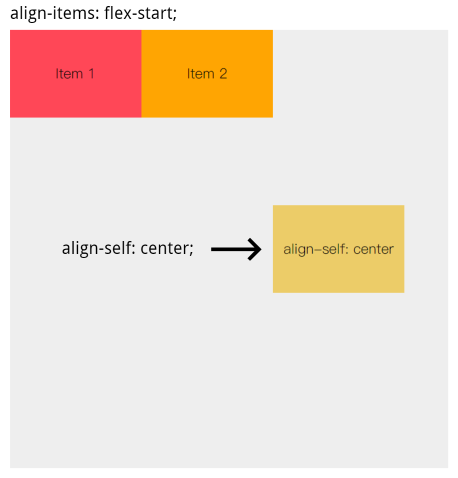
align-self控制的是当前项目在交叉轴上的排列方式,并覆盖原本 align-items的值。

默认值是auto,代表继承容器align-items的值。
