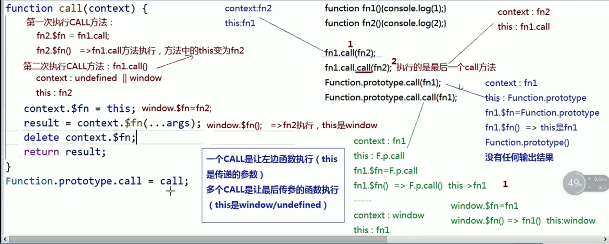

# call 实现

    改变this
```js
Function.prototype.call = function (content,...args){
  content = content?Object(content):window
  content.fn = this
  let result = content.fn(...args)
  delete content.fn
  return result
}
```
    一个call是让左边函数执行(this是传递的参数)
    多个call是让最后传入的参数执行(this时window/undefined)

# apply
    改变this
    同call相同，第一个参数相同，第二个参数变成数组传递


# bind
    1.改变this
    2.会返回一个绑定后的函数
    3.如果绑定的函数被new了 当前函数的this就是当前实例
    4.new出来的结果可以找到原有类的原型
```js
let obj = {
  name:'小明'
}
function fn1(name,age){
  console.log(this.name,name,age)
},
Function.prototype.bind = function(content){
  let that = this
  let bindArgs = Array.prototype.slice.call(argument,1)//获取除了第一参数后面的参数
  function Fn(){} //Object.create原理
  function fBound(){
    let args = Array.prototype.slice.call(argument);// 获取调用bind后函数传入的参数
    this.apply(this instanceof fBound? fBound : content,bindArgs.concat(args))
  }
  Fn.prototype = this.prototype
  fBound.prototype = new Fn()
  return fBound
}
fn.prototype.flag = '汪汪汪'
let bindFn = fn.bind(obj,'狗')
bindFn(9)
let instance = new bindFn(10)
```
