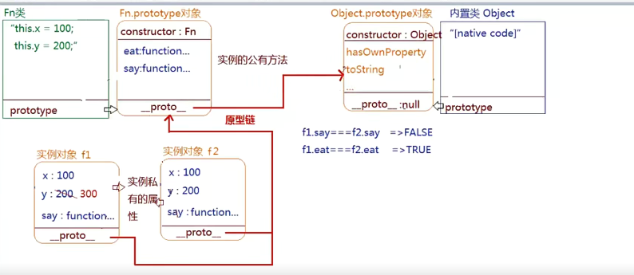

# 原型及原型链模式

1.每一个函数数据类型的值都有一个天生自带的属性:prototype,这个属性的属性值是一个对象(`用来存储实例公用的属性和方法的`)
- 普通函数
- 类(自定义类和内置类)

2.在prototype这个对象中，有一个天生自带的属性:constructor,这个属性存储的是当前函数本身
  ```js
    Fn.prototype.consructor === Fn
  ```
3.每一个对象数据类型的值,也有一个天生自带的属性:__proto__,这个属性指向所属类的原型prototype
- 普通对象,数组,正则,Math,日期,类数组等
- 实例也是对象数据类型的值
- 函数的原型prototype属性的值也是对象类型的
- 函数也是对象数据类型的值

# 原型链查找机制
  1.先找自己私有的属性,有则调取使用,没有则继续向上找
  2.基于__proto__找所属类原型上的方法(Fn.prototype),如果还没有则继续基于__proto__网上查找...一直到Object.prototype为止
