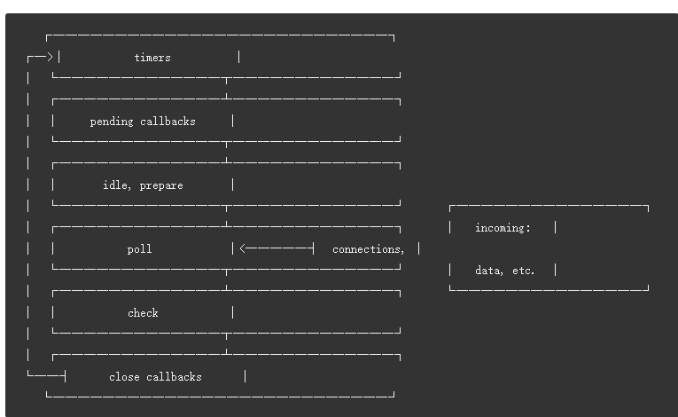

# 浏览器事件环和node事件环

## node事件环

默认是先从上到下依次执行，依次清空每个队列中的回调，每调用一个宏任务都会清空微任务

//宏任务 (老版本中是每清空完毕一个队列后才会去执行微任务)
- timer/定时器:存放所有定时器，本阶段执行已经被setTimeout()和setInterval()的调度回调函数

- pending callbacks待定回调：执行延迟到下一个循环迭代的 I/O 回调。

- idle,prepare: 仅系统内部使用

- poll/轮询：主要存放的异步i/o操作 node中基本上所有的异步api的回调都会在这个阶段来处理，检索新的i/o事件，执行以i/o相关的回调

- check/检测：setImmediate() 回调函数在这里执行

//setImmediate  Node.js 事件循环的此回合结束时要调用的函数 安排在 I/O 事件的回调之后立即执行的 callback。

//主栈执行完后 =》先去清空微任务=》 检测时间有没有达到定时的，有就执行  =》在清空微任务 =》进入poll轮询阶段，如上清空fs的回调，如果check不为空，会进入check阶段，如果不为空，会停在poll阶段，等待其他阶段的回调达到执行的条件

//nextTick
process.nextTick() 会添加 callback 到下一个时间点队列。 在 JavaScript 堆栈上的当前操作运行完成之后，且允许事件循环继续之前，此队列会被完全耗尽。会在微任务之前执行

## 浏览器事件环

//浏览器微任务mutationObserver  promise 
//宏任务 setTimout/setInterval
