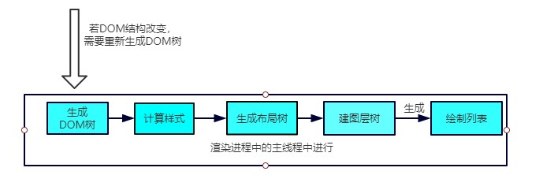

# 回流(重排)
    触发条件: 就是当我们DOM结构的修改引发DOM几何尺寸变化的时候,会发生回流

哪些操作回触发回流:
  - 1.一个DOM元素的几何属性发生变化,常见的几何属性有width/height/padding/margin/left/top/border 等等
  - 2.使DOM节点发生增减或者移动
  - 3.读写offset族,scroll族,client族属性的时候,浏览器为了回去这些值，需要进行回流操作
  - 4.调用window.getComputedStyle方法

回流过程
    依照上面的渲染流水线,触发回流的时候,如果DOM接口发生了该表,则重新渲染DOM树,然后将后面的流程全部走一遍

# 重绘

    触发条件:当DOM修改样式导致了样式的变化,并且没有影响几何属性的时候,会导致重绘

跳过了 生成布局树 和 构建布局树 的阶段，直接生成绘制列表，然后继续进行分块，生成位图等后面一系列操作

重绘比一定会导致回流，但回流一定会导致重绘

# 合成

    还有一种情况,是直接合成。比如利用CSS3的transform,opacity,filter这些属性就可以实现合成效果，也就是GPU加速

    GPU加速的原因
    在合成的情况下，会直接跳过布局和绘制流程，直接进入非主线程处理的部分，即直接交给合成线程处理。交给它处理有两大好处:

    - 能够充分发挥GPU的优势。合成线程生成位图的过程中会调用线程池，并在其中使用GPU进行加速生成，而GPU 是擅长处理位图数据的。

    - 没有占用主线程的资源，即使主线程卡住了，效果依然能够流畅地展示。

## 对于重绘重排的优化
  [DocumentFragments](https://developer.mozilla.org/zh-CN/docs/Web/API/Document/createDocumentFragment) 是DOM节点。它们不是主DOM树的一部分。通常的用例是创建文档片段，将元素附加到文档片段，然后将文档片段附加到DOM树。在DOM树中，文档片段被其所有的子元素所代替。

    因为文档片段存在于内存中，并不在DOM树中，所以将子元素插入到文档片段时不会引起页面回流（对元素位置和几何上的计算）。因此，使用文档片段通常会带来更好的性能。
- 1.避免频繁的使用style，采用class的方式。
- 2.使用createDocumentFragment创建一个新的空白的文档片段进行批量操作。(vue,react的虚拟DOM等)
- 3.对于resize,scroll等进行防抖/节流处理
