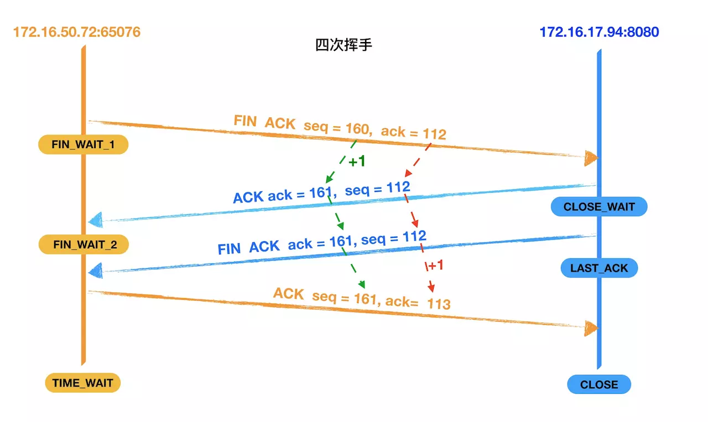

# 1.OSI七层网络模型
    OSI是Open System Interconnection的缩写,意为开放式系统互联.国际标准化组织(ISO)制定了OSI模型,该模型定义了不同计算机互联的标准,是设计和描述计算机网络通信的基本框架。
    OSI模型把网络通信的工作分为7层,分别是物理层,数据链路层,网络层,传输层,会话层,表示层和应用层。

OSI参考模型 || 各层的解释
-|-|-
应用层 || 提供网络与用户应用软件之间的接口服务(HTTP)
表示层 || 提供格式化的表示和转换数据服务，如加密和压缩
会话层 || 提供包括访问验证和会话管理在内的建立和维护应用之间通信的机制
传输层 || 提供建立、维护和取消传输连接功能，负责可靠地传输数据(TCP)
网络层 || IP选址及路由选择，处理网络间路由，确保数据及时传送(路由器)
数据链路层 || 提供介质访问和链路管理负责无错传输数据，确认帧、发错重传等(交换机)
物理层 || 提供机械、电气、功能和过程特性(网卡、网线、双绞线、同轴电缆、中继器)

# 2.TCP/IP参考模型
    TCP/IP是传输控制协议/网络互联协议的简称。早期的TCP/IP模型是一个四层结构，从下往上依次是网络接口层，互联网层，传输层和应用层。
    后来在使用过程中，借鉴OSI七层参考模型，奖网络接口层划分为了物理层和数据链路层，形成五层结构。

[相关链接](grow/html/67-1-network.html)

# 3.三次握手

    TCP是面向连接的,无论哪一方向另一方发送数据之前，都必须先在双方之间建立一条连接。在TCP/IP协议中，TCP协议提供可靠的连接服务，连接是通过三次握手进行初始化的。
    三次握手的目的是同步连接双方的序列号和确认号并交换TCP窗口大小信息

### 如图：

    为了方便描述我们将主动发起请求的172.16.17.94:8080 主机称为客户端,将返回数据的主机172.16.17.94:8080称为服务器，以下也是。

    - 第一次握手:建立连接。客户端发送连接请求，发送SYN报文,将seq设置为0.然后,客户端进入SYN_SEND状态,等待服务器确认。

    - 第二次握手:服务器接收到客户端的SYN报文段。需要对这个SYN报文段进行确认，发送ACK报文，将ack设置为1。同时，自己还要发送SYN请求信息，将seq设置为0.服务器端将上述所有信息一并发送给客户端，此时服务器进入SYN_RECV状态

    - 第三次握手:客户端收到服务器的ACK和SYN报文后，进行确认，然后将ack设置为1，seq设置为1，向服务器发送ACK报文字段，这个报文段发送完毕以后，客户端和服务端都进入ESTABLISHED状态，完成TCP三次握手

# 4.数据传输

### 图：
  
  

    - 客户端先向服务器发送数据，该数据报的长度为159的数据。

    - 服务器收到报文后，也向客户端发送了一个数据进行确认(ACK)，并且返回客户端要请求的数据，数据的长度为111，将seq设置为1，ack设置为160(1 + 159)。

    - 客户端收到服务器返回的数据后进行确认(ACK),将seq设置为160，ack设置为112(1 + 111)。

# 5.四次挥手

### 图：

    - 第一次挥手：客户端向服务器发送一个FIN报文段，将设置seq为160和ack112，此时，客户端进入FIN_WAIT_1状态，这表示客户端没有数据要发送给服务器了，请求关闭连接。

    - 第二次挥手：服务器收到了客户端发送的FIN报文段，向客户端回一个ACK报文字段，ack设置为1，seq设置为112，服务器进入了CLOSE_WAIT状态，客户端收到服务器返回的ACK报文后，进入FIN_WAIT_2状态。

    - 第三次挥手：服务器会观察自己是否还有没有数据发送给客户端，如果有，先把数据发送给客户端，再发送FIN报文。如果没有，那么服务器直接发送FIN报文给客户端。请求关闭连接，同时服务器进入LAST_ACK状态。

    - 第四次挥手：客户端收到服务器发送的FIN报文段，向服务器发送ACK报文段，将seq设置为161，ack设置为113，然后客户端进入TIME_WAIT状态，服务器是收到客户端的ACK报文段以后，就关闭连接，此时，客户端等待2MSL后依然没有收到回复，则证明Server端已正常关闭，客户端也可以关闭连接了

`注意:握手和挥手是确认号应该是对方序列号加一，传输数据时则是对方序列号加上对方携带应用数据的长度`
