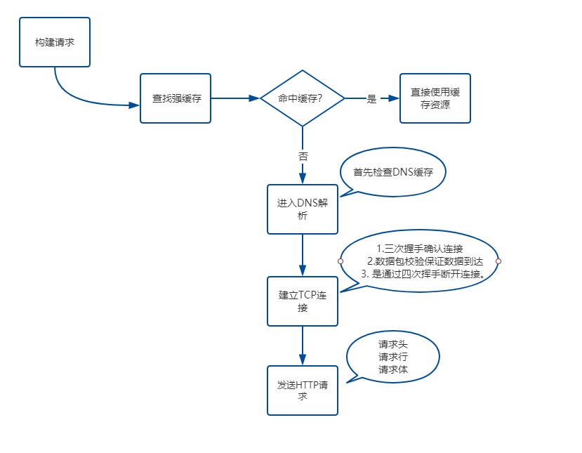
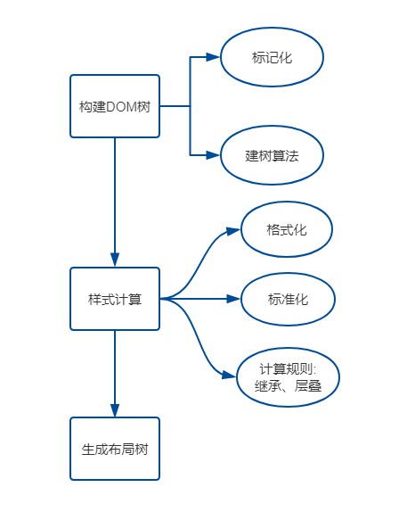
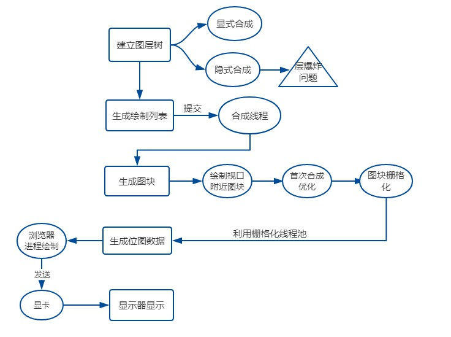

## 网络

- 1.浏览器首先会构建请求，然后去检查缓存中是否有，如果存在直接返回

- 2.然后查看域名是否被解析过，如果解析过直接用缓存，不需要在走解析，如果没有，然后将域名解析成对应的ip，浏览器都具有缓存DNS数据的功能，解析过一次后下次就会走缓存（如果不指定端口默认访问的是80端口）
- 3.建立tcp链接(谷歌在同一域名下同时最多只能建立6个http请求超出部分等待)，建立连接共分为三个阶段

      1.通过三次握手(即总共发送3个数据包确认已近建立连接)建立客户端与服务器之间的连接
      2.进行数据传输。这里有个重要的机制，就是接收方接收到数据包后必须要向发送方确认，如果发送方没有收到这个确认消息，就判定为数据包丢失，并重新发送该数据包。(优化策略，把大的数据包拆分成一个个小包依次传输到接收方，接收方按照这个小包的顺序把他们组装成完整的数据包使用)
      3.断开连接，数据传输完成，通过四次挥手来断开连接
- 4.发送HTTP请求
    建立TCP连接后，浏览器就可以和服务器开始通讯，浏览器开始发送http请求，携带三样东西：(请求行，请求头，请求体)。响应具有:(响应行，响应头和响应体)

    响应完成后判断connetion字段，如果请求头或响应头中包含Connection: Keep-Alive，表示建立课持久连接，这样tcp连接会一直保持，之后的请求同一站点就会复用该连接

## 浏览器算法解析篇

  完成了网络请求和响应后，如果响应头中Content-type是text/html,那么接下来就是浏览器的解析和渲染工作了
  
  
  - 1.浏览器无法直接使用HTML,需要将HTML转化成DOM树。(document)
  - 2.浏览器无法解析纯文本的css样式,需要对css进行解析,解析成styleSheets。CSSOM(document.styleSeets)
  - 3.计算出DOM树中每个节点的具体样式(Attachment)
  - 4.创建渲染(布局)树，将DOM树中的可见节点，添加到布局树中。并计算节点渲染到页面的坐标位置。(layout)
  - 5.通过布局树,进行分层(根据定位属性，透明属性，transform属性，clip属性等)生产图层树
  - 6.将不同图层进行绘制,转交给合成线程处理。最终产生页面，并呈现到浏览器中

## 渲染过程

## 总结：DOM如何生成的
 - 当服务端返回的类型是text/hmtl时,浏览器会将数据通过HTMLParser进行解析(边下载边解析)
 - 在解析前会执行预解析操作,会预先加载JS，CSS等文件
 - 字节流 -> 分词器 -> Tokens -> 根据token生成节点 -> 插入到 DOM树中
 - 遇到js:在解析过程中遇到script标签，HTMLParser会停止解析，（下载）执行对应的脚本。
 - 在js执行前，需要等待当前脚本之上的所有CSS加载解析完毕（js是依赖css的加载）

- CSS样式文件尽量放在页面头部，CSS加载不会阻塞DOM tree解析,浏览器会用解析出的DOM TREE和 CSSOM 进行渲染，不会出现闪烁问题。如果CSS放在底部，浏览是边解析边渲染，渲染出的结果不包含样式，后续会发生重绘操作。
- JS文件放在HTML底部，防止JS的加载、解析、执行堵塞页面后续的正常渲染
