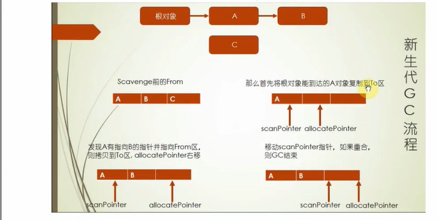

# V8垃圾回收机制

- V8是基于分代的垃圾回收
- 不同代垃圾回收机制也不一样
- 按照存活的时间分为新生代和老生代

# 分代内存
  默认情况下：
  32位系统新生代内存大小为16MB,老生代内存大小为700MB
  64位系统下，新生代内存大小为32MB，老生代内存大小为1.4GB

新生代又分From 和 To  区域;64位中新生代内存为32M,From区域和To区域各占16M,32位中From区域和To区域各占8M

# 新生代
# 标记清除
 当变量进入环境(例如，在函数中声明一个变量)时,将这个变量标记位'进入环境'.永远不能释放进入环境的变量所占用的内存，因为只要执行流进入相应的环境，就可能会用到它们。而当变量离开环境时，则将其标记为“离开环境”。

 垃圾收集器在运行的时候会给存储在内存中的所有变量都加上标记，然后它会去掉环境中的变量已经被环境中变量被标记为引用的变量，在此之后再被标记的变量将被视为准备删除的变量。最后垃圾回收器清除标记的变量，回收它们所占用的内存空间
# 引用计数
当声明了一个变量并将一个引用类型的值赋值给变量,则这个值的引用技术加一

如果同时又被赋值给了另一个变量,则该引用计数加一,向反减一。

当计数位0是下次回收器运行的时候就会被释放

但是存在相互引用不能释放问题

# 晋升
    当一个对象经过多次复制仍然存活时，它就会被认为是生命周期较长的对象。这种较长生命周期的对象随后会被移动到老生代中，采用新的算法进行管理。

对象从新生代移动到老生代的过程叫作晋升。

对象晋升的条件主要有两个：

- 对象从From空间复制到To空间时，会检查它的内存地址来判断这个对象是否已经经历过一次Scavenge回收。如果已经经历过了，会将该对象从From空间移动到老生代空间中，如果没有，则复制到To空间。总结来说，如果一个对象是第二次经历从From空间复制到To空间，那么这个对象会被移动到老生代中。

- 当要从From空间复制一个对象到To空间时，如果To空间已经使用了超过25%，则这个对象直接晋升到老生代中。设置25%这个阈值的原因是当这次Scavenge回收完成后，这个To空间会变为From空间，接下来的内存分配将在这个空间中进行。如果占比过高，会影响后续的内存分配。

# 老生代
- mark-sweep(标记清楚)mark-compact(标记整理)

## mark-sweep(标记清除)
- 标记活着的对象,随后清除在标记阶段没有标记的对象,只清理死亡的对象
- 问题在于清除后会出现内存不连续的情况,这种内存碎片会对后续的内存分配产生影响
- 如果要分配一个大对象,碎片空间无法分配

## mark-compact(标记整理)
- 标记死亡后会对对象进行整理,活着的对象向左移动,移动完成后直接清理掉边界外的内存

