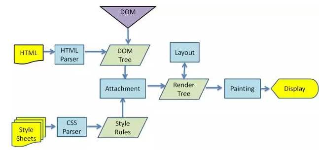

- 用户输入url地址(关键字 会将关键字根据默认的引擎生成地址) 会开始导航 浏览器进程里面去做
- 浏览器进程 会准备一个渲染进程用于渲染页面
- 网络进程加载资源,最终将加载的资源交给渲染进程来处理
- 渲染完毕后显示

- 网络七层模型 (物理层 数) 网(ip) 传 (tcp 安全可靠 分段传输,udp 丢包) （会 表 应） http

- 先去查找缓存， 检测缓存是否过期。 直接返回缓存中内容

- 看域名是否被解析过， DNS协议 将域名解析成ip地址 (DNS 基于UDP) ip + 端口号 host

- 请求是HTTPS SSL协商

- ip地址来进行寻址，排队等待， 最多能发送6个http请求

- tcp 创建链接 用于传输 （三次握手）

- 利用tcp传输数据 （拆分成数据包 有序） 可靠 、 有序， 服务器会按照顺序来接受

- http请求 （请求行 请求头 请求体）

- 默认不会断开 keep-alive 为了下次传输数据时 可以复用上次的创建的链接

- 服务器收到数据后 (响应行 响应头 响应体)

- 服务器 返回301 302 会进行重定向操作

- 服务器 304 去查询浏览器缓存进行返回

浏览器接受资源后怎么处理

http 0.9 负责传输html 最早的时候没有请求头 和响应头
http 1.0 提供了 http的header 根据header的不同来处理不同的资源
http 1.1 默认开启了keep-alive 链接复用 管线化 服务器处理多个请求 （对队阻塞问题）
http 2.0 用同一个tcp链接来发送数据 一个域名一个tcp (多路复用) 头部压缩 服务器可以推送数据给客户端
http 3.0 解决了tcp的队头阻塞问题 QUIC协议 采用了udp

## 渲染流程 浏览器收到内容后如何解析的

