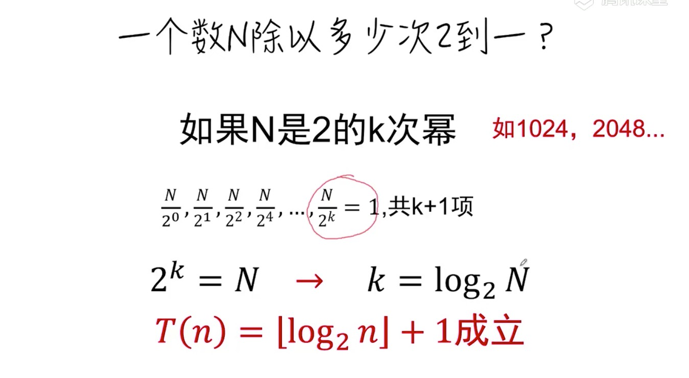
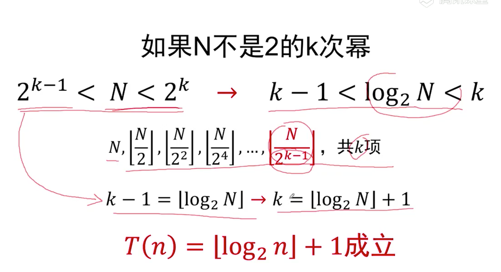

##  二分查找



```js
 function bsearch(A,x) {
    let l = 0, //查询范围作边界
        r = A.length - 1, //查询范围右边界
        guess // 猜测中间的位置
    while(l <= r) {
        guess  = Math.floor( (l+r)/2 )
        // 循环不变式
        // guess等于l，r中间位置
        // l:查找范围左 r:查找范围右
        if(A[guess] === x) return guess
        else if(A[guess] > x) r = guess -1 //如果中间位置大于查询的值，可查找范围右边变为guess右边减一的位置
        else l = guess + 1 //反之左边加一
        //循环不变式
        //l:新查找范围左 r:新查找范围右
    }
    return -1    
 }
 const A = [3,5,19,22,25,33,45,57,66,71,78];
 console.log( bsearch(A, 88) )
```