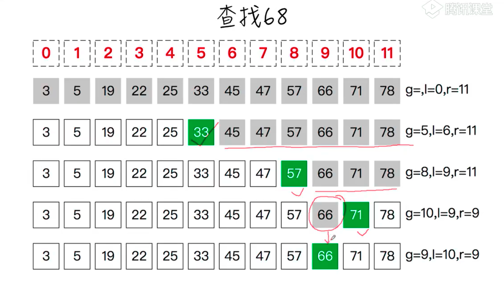

##  二分查找




```js
 function bsearch(A,x) {
    let l = 0, //查询范围作边界
        r = A.length - 1, //查询范围右边界
        guess // 猜测中间的位置
    while(l <= r) {
        guess  = Math.floor( (l+r)/2 )
        // 循环不变式
        // guess等于l，r中间位置
        // l:查找范围左 r:查找范围右
        if(A[guess] === x) return guess
        else if(A[guess] > x) r = guess -1 //如果中间位置大于查询的值，可查找范围右边变为guess右边减一的位置
        else l = guess + 1 //反之左边加一
        //循环不变式
        //l:新查找范围左 r:新查找范围右
    }
    return -1    
 }
 const A = [3,5,19,22,25,33,45,57,66,71,78];
 console.log( bsearch(A, 88) )
```

```js
    //递归版
    function bsearch(A,p,r,x,z=0){
    const guess = Math.floor((r-p)/2)+z
    console.log(guess)
    if(p>=r) return - 1
    if(A[guess] === x) return guess
    return A[guess]>x?bsearch(A,p,guess-1,x):bsearch(A,guess+1,r,x,z)
}

let arr = [1,2,3,4,6,7,8,9]
bsearch(arr,0,arr.length-1,6)
```