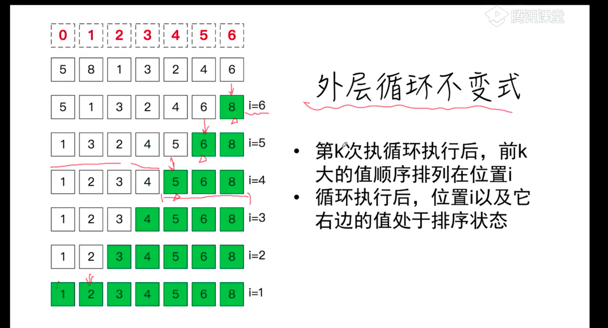
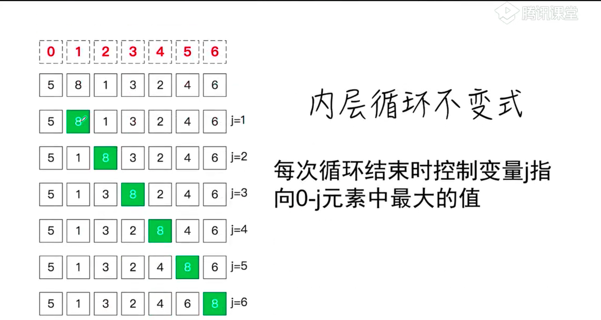

# 冒泡排序
 
 

```js
function swap(A,i,j){
    const t = A[i]
    A[i] = A[j]
    A[j] = t
}
function bubble_sort(A){
    for(let i = A.length-1;i>=1;i--){
        for(let j = 1; j<=i; j++){
            A[j-1]>A[j]&&swap(A,j-1;j)
        }
    }
}
```