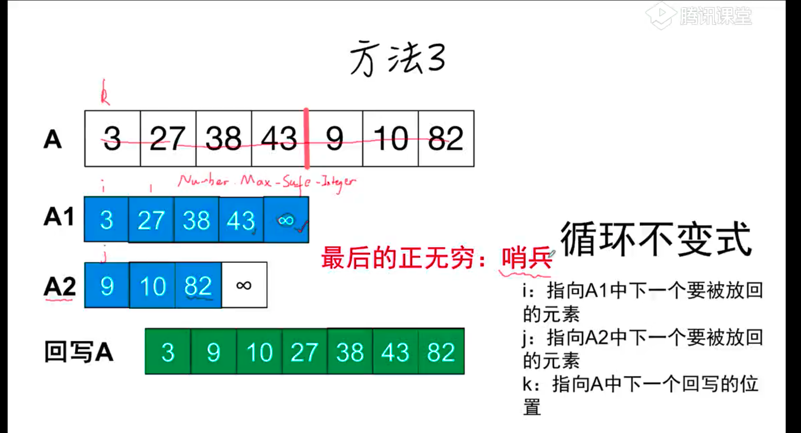
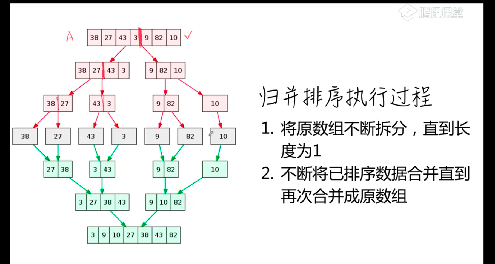
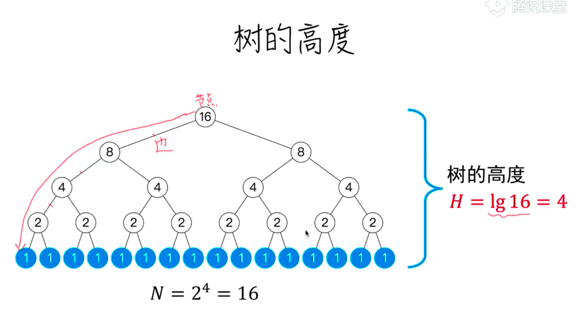
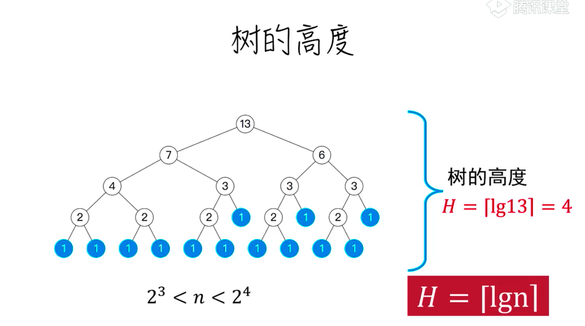

```js
function merge(A,p,q,r){
    let A1 =A.slice(p,q);
    let A2 =A.slice(q,r);
    A1.push(Number.MAX_SAFE_INTEGER)
    A2.push(Number.MAX_SAFE_INTEGER)
    for(let k = p,i=0,j=0;k<r;k++){
        A[k] = A1[i]>A2[j]?A2[j++]:A1[i++]
    }
}
```


```js
//递归拆分
function merge_sort(A,p,r){
    if(p-r<2){return}
    const q = Math.ceil((p+r)/2)
    merge_sort(A,p,q)
    merge_sort(A,q+1,r)
    merge(A,p,q,r)
}
```

# 复杂度




