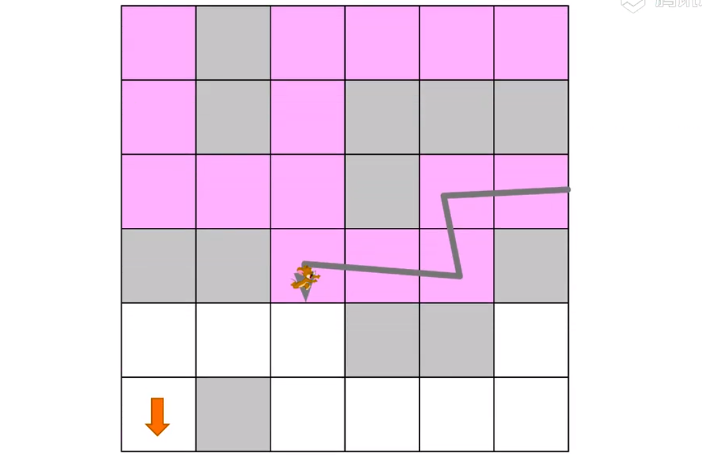
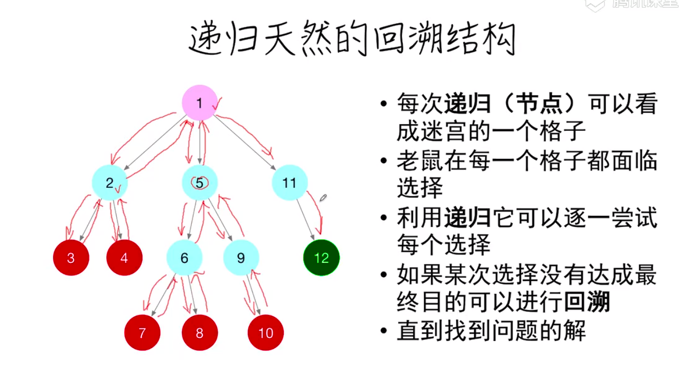
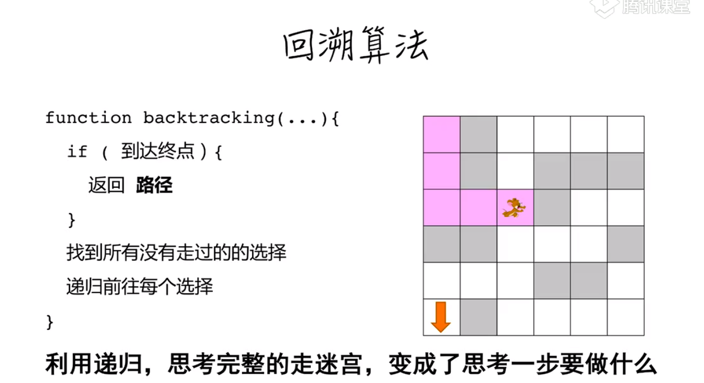
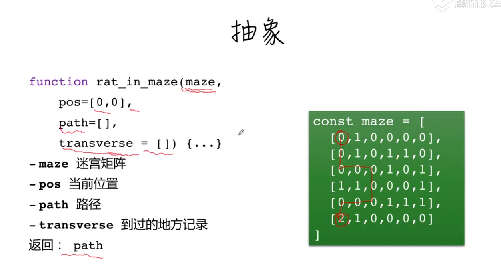

# 回溯算法








```js
//maze整个路径
//pos起始点/位置
//path是路径
//transverse走过的位置 
function rat_in_maze(
    maze,pos = [0,0], path =[[...pos]],transverse = []
){
    const [x,y] = pos
    if(maze[x][y] === 2){// 基础条件 等于2成功
        return path
    }
    // 记录走过的位置 ，由于用的一维数组则有下列
    transverse[x*maze.length+y] = 1;
    //找到所有的可能性
    const choices = [
        [x+1,y],[x-1,y],
        [x,y+1],[x,y-1],
    ].filter(([x,y])=>{
        return x>=0&&y>=0&&x<maze.length&&y<maze[0].length&&
        (maze[x][y]!==1)&&!(transverse[x*maze.length+y])
    })
    for(let [x,y] of choices){
        const p = rat_in_maze(maze,[x,y],path.concat([[x,y]]),transverse)
        if(p) return p
    }
}
```