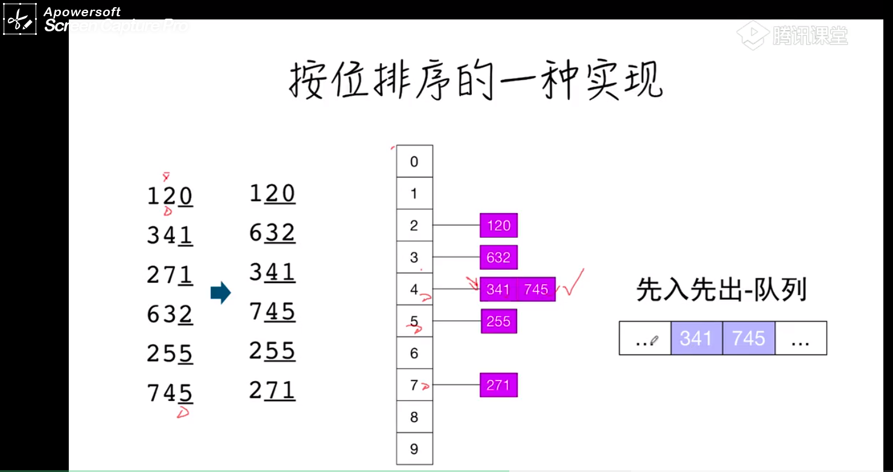

# 基数排序



```js
function radix_sort(A){
    const max = Math.max(...A);
    const buckets = Array.from({length:10},()=>[])
    //有效位数
    let m = 1;
    while(m<max){
        //将数组中的元素放入桶中
        A.forEach(number=>{
            const digit = ~~((number%(m*10))/m)//取整
            buckets[digit].push(number)
        })
        //从桶中取元素
        let j = 0;
        buckets.forEach(bucket=>{
            while(buckets.length>0){
                A[j++] =  bucket.shift()
            }
        })
        //下一位
        m*=10
    }
}
```