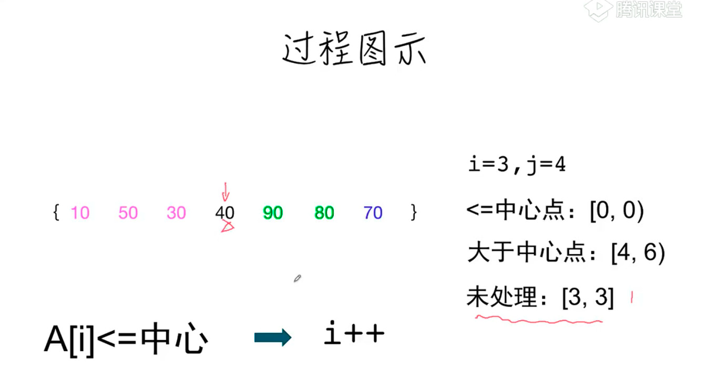
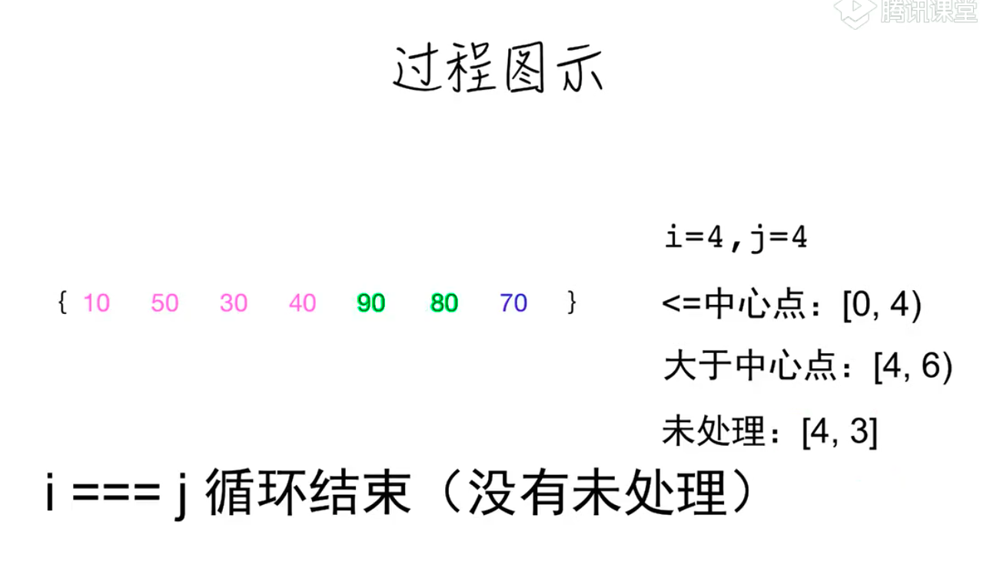
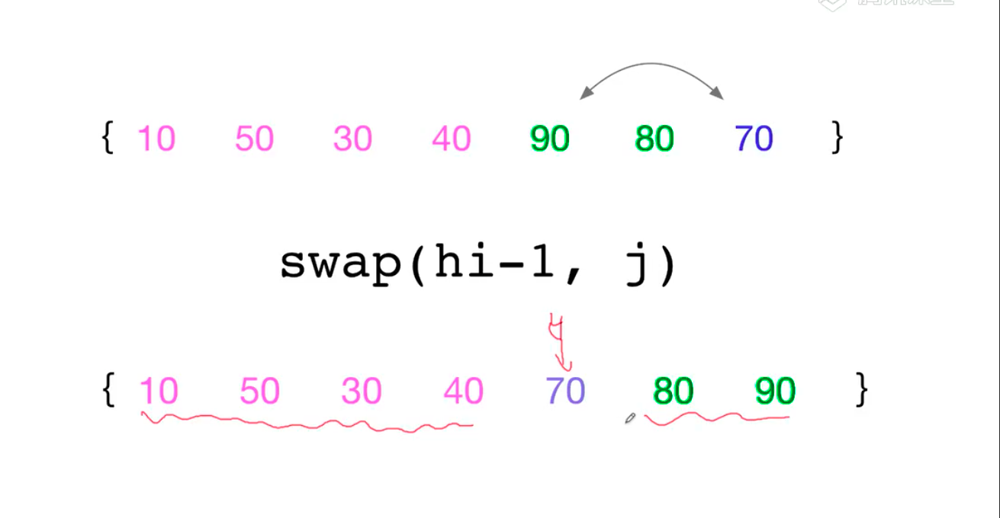

# 快速排序





```js
    function swap(A,i,j){
        [A[i],A[j]]=[A[j],A[i]]
    }
    function partition(A,lo,hi){
        const pivot = A[hi-1]
        let i = lo, j = hi -1;
        // 小于中心点范围：[lo,i)
        // 未确认范围:[i,j)
        // 大于中心点范围：[lo,h1-1)
        while(i !== j){
            if(A[i]< =pivot){
                i++
            }else{
                swap(A,i,--j)
            }
        }
        swap(A,j,h-1)
        return j
    }
    function qsort(A,lo=0,hi = A.length){
        if(hi- lo <=1) return 
        let p = partition(A,lo,hi)
        qsort(A,lo,p)
        qsort(A,p+1,hi)
    }
```