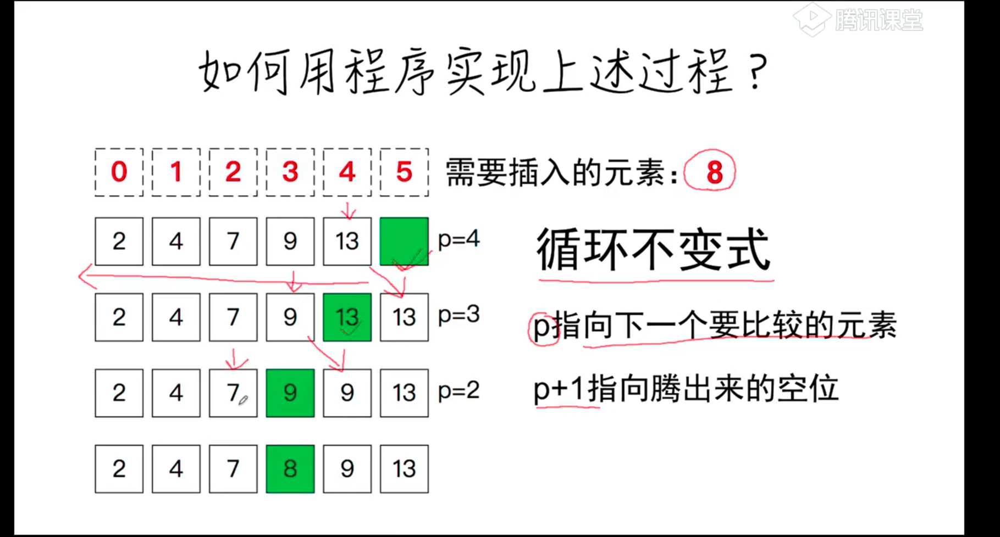
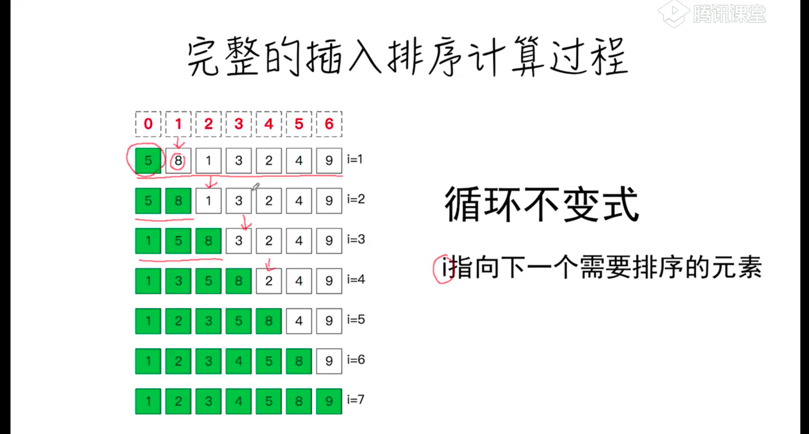
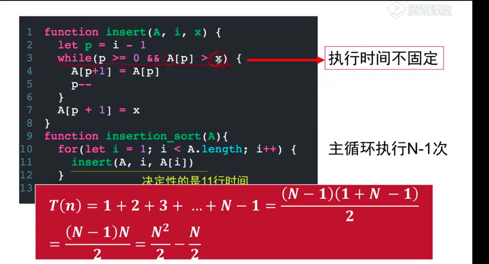

# 插入排序
 
```js
//有序插入
function insert(A,x) {
    let p = A.length-1
    while(p>=0 && A[p] > x){
        A[p+1] = A[p]
        p--
    }
    A[p+1] = x
}
```
 
```js
//乱序数组插入排序
function insert(A,i,x){
    let p = i - 1;
    while(p>=0&&A[p]>x){
        A[p+1] = A[p]
        p--
    }
    A[p+1] = x
}
function insertion_sort(A){
  for(let i = 1; i <A.length; i++){
      insert(A,i,A[i])
  }  
}
const A = [2,1,3,4,6,9,7]
insertion_sort(A
)
```

 