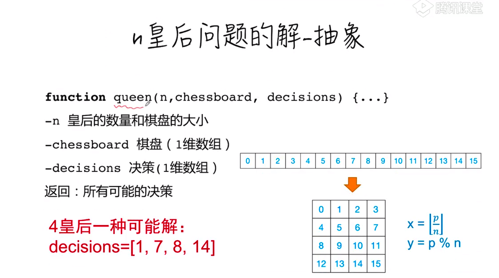
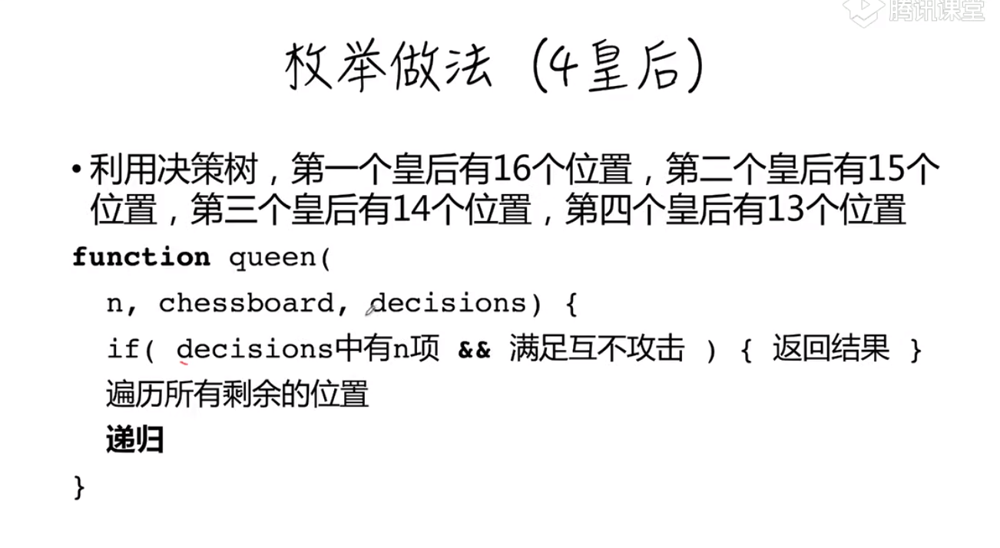

# 搜索问题(8皇后)


```js
//判断棋盘上两个皇后是否会相互攻击
//~~(x) = Math.floor(x)
//n表示皇后的个数
function compatible(p,q,n){
    const [x1, y1] = [~~(p/n),p%n]
    const [x2, y2] = [~~(q/n),q%n]
    return x1 !== x2 && y1 != y2 && Math.abs(x1-x2) !== Math.abs(y1 - y2)
}

//判断一个决策是不是最终的答案 4种皇后一种可能解:decisions = [1,7,8,14]
//n个数的排列 = n!=n*(n-1)*(n-2)*.*1
function is_goal(n,decisions){
    for(let i = 0; i<n;i++){
        for(let j = i+1; j<n;j++){
            if(i===j){
                containue
            }
            if(!compatible(decisions[i],decisions[j],n)){
                return false
            }
        }
    }
    return true
}
```

## 枚举


```js
    function queen(n,decisions = []){
        if(decisions.length === n){
            return is_goal(n,decisions) ? [decisions]:[]
        }
        let r = []
        for(let i =0;i<n*n;i++){
            if(decisions.indexOf(i)===-1){
                r = r.concat(queen(n,decisions.concat(i)))
            }
        }
    }
```