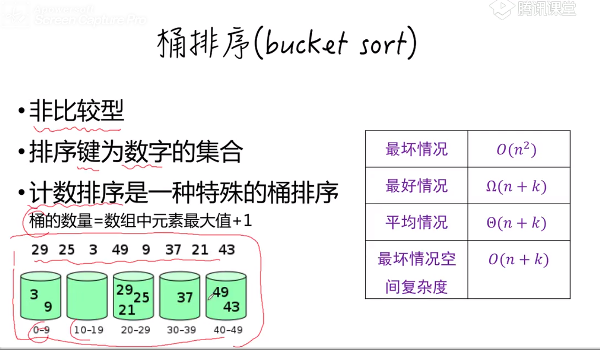
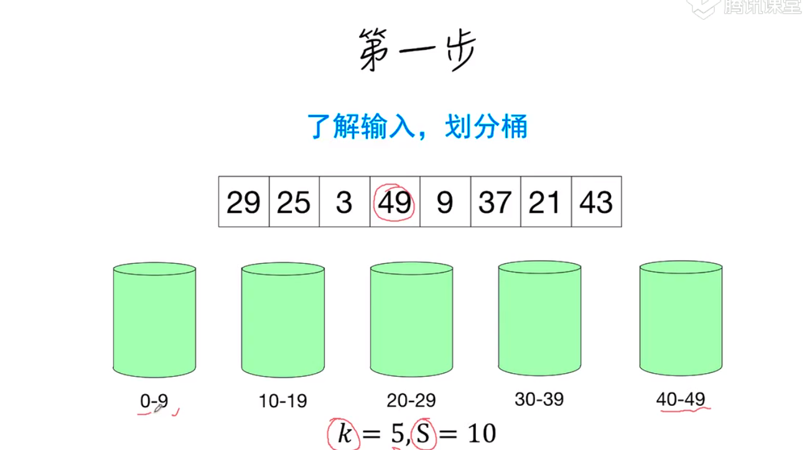
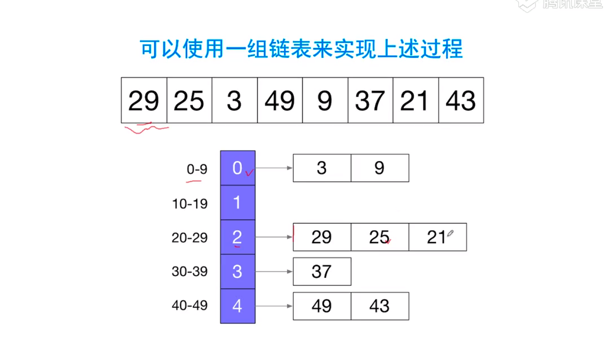
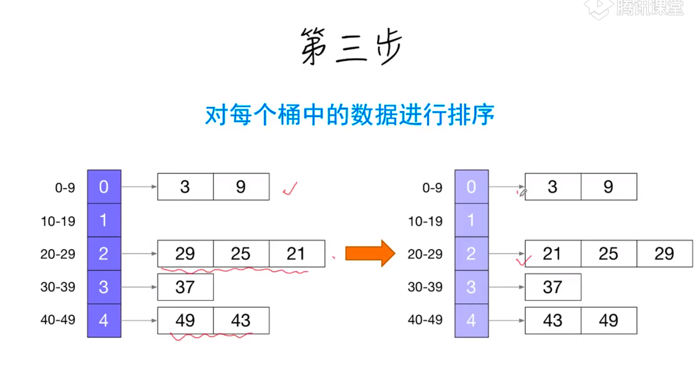
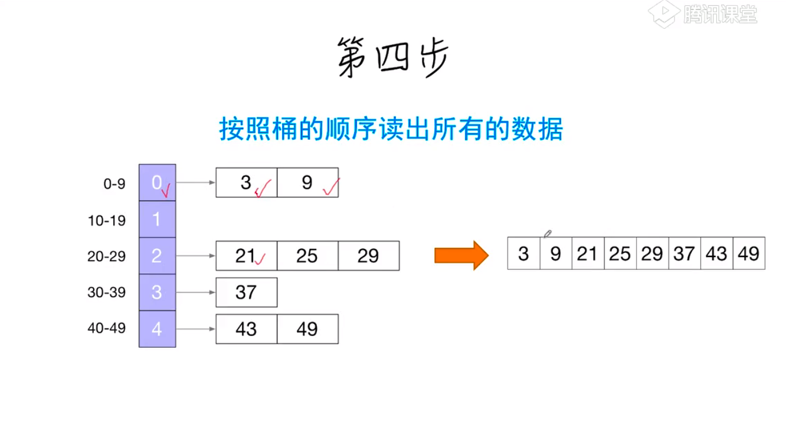
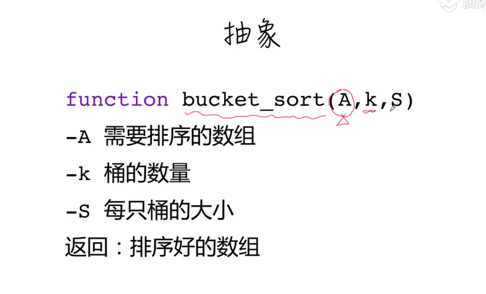

# 桶排序








```js
function insertion_sort(A){
    for(let i = 1; i < A.length; i++){
        let p = i-1
        const x = A[p+1]
        while(p>=0 && A[p]>x){
            A[p+1] = A[p]
            p--
        }
        A[p+1] = x
    }
}
//A需要排序数组，K桶的个数，S每个桶的大小
function bucket_sort(A,K,S){
    const buckets = Array.from({length:k},()=[])
    //放入桶
    for(let i = 0; i < A.length; i++){
        const index = ~~(A[i]/S)//向下取整
        buckets[index].push(A[i])
    }
    //对每个桶中排序
    for(let i = 0; i < buckets.length; i++){
        insertion_sort(buckets[i]) //使用插入排序对桶中元素进行排序
    }
    return [].concat(...buckets)
}
```