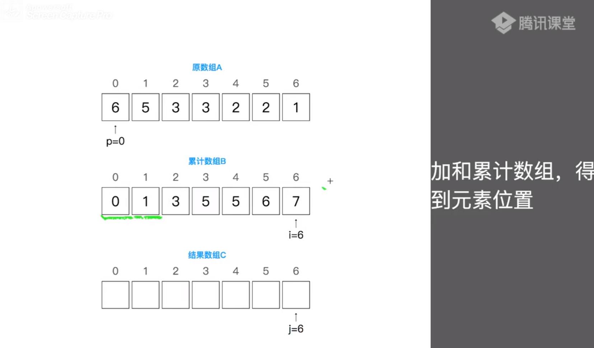
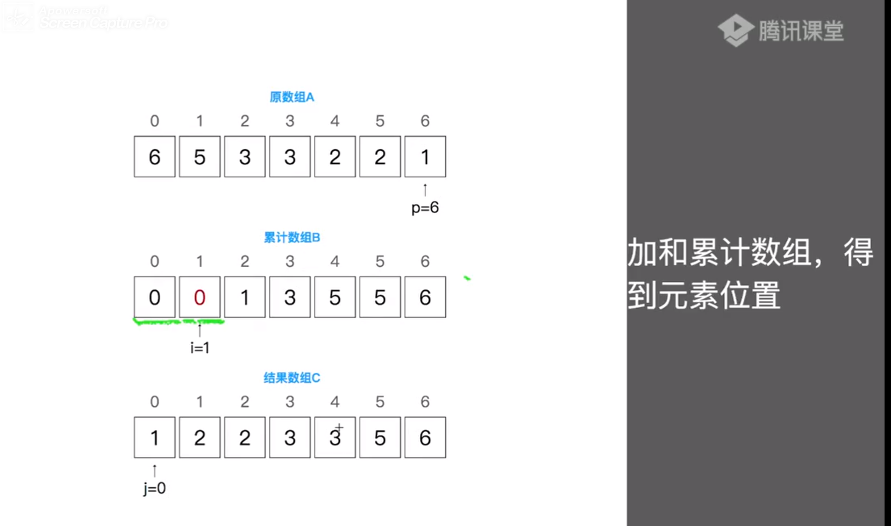

# 计数排序



```js
function counting_sort(A){
    const max = Math.max(...A);
    //累计数组
    const B = Array(max+1).fill(0)
    //结果数组
    const C = Array(A.length)
    //累计位递增
    A.forEach((_,i)=>B[A[i]]++)
    //累计求和
    for(let i = 1; i <B.length;i++){
        B[i]=B[i-1]+B[i]
    }
    //取出结果
    for(let i =0;i<A.length;i++){
        const p = B[A[i]]-1 //回写位置
        B[A[i]]-- //新回写位置
        C[p] = A[i]  // 回写结果
    }
    return C
}
```