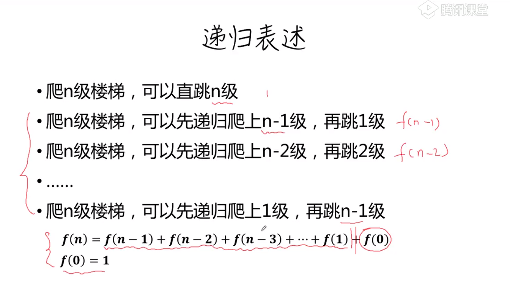

# 爬楼梯


```js
//递归实现
function steps(n){
    if(n == 0){
        return 1
    }
    return [...Array(n)].map((_,i)=>i)//生成[0,1,2,3,4,5,....,n-1]
    .reduce((s,i)=>{
        return steps (i)+s 
    },0)
}
```

```js
//优化自下而上构造
function steps(n){
    const s = [1,1]
    for(let i = 2; i <= n; i++){
        s[i] = s.reduce((a,b) => a+b)
    }
}
```
